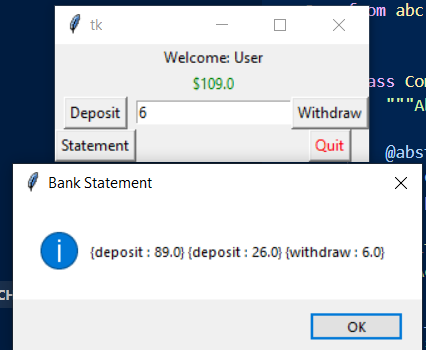

# Lista7CES22
Command:
The client code contain the bank account selected, with the username "User". Then, the Tkinter starts a bank screen, with the options "Deposit", "Withdraw", "Statement" and "Quit"
buttons. The screen also has a pannel to input the value we want to withdraw or deposit and another pannel with the current account value.

State:
The client code countain the initial state and the transtitions of states. In the current example, we start in draft, then go to moderation, published, draft, published.
The publish doesn't has a path to moderation, so the last transition can't occur.

